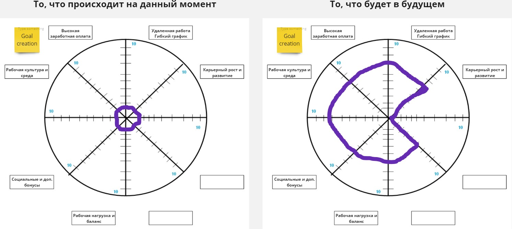
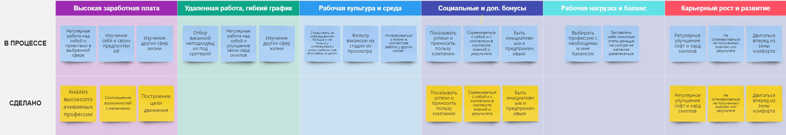
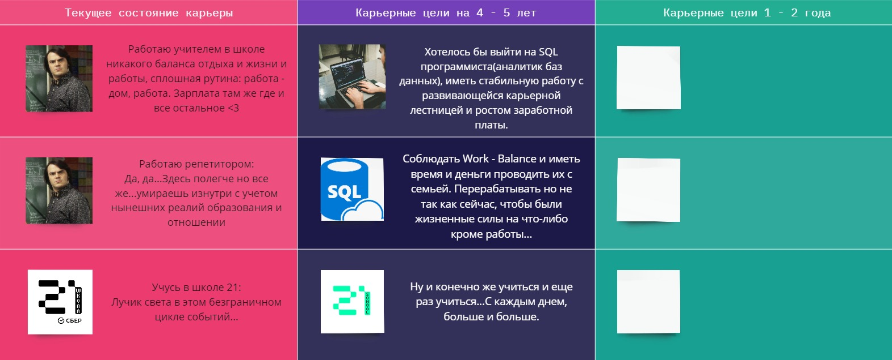

# Career track. Project 00
### Exercise 00 
- В этом задании необходимо было сделать свои желаемые критерия для работы, рассказать о своей нынешней ситуации и сделать желаемое колесо критериев для будущего плюс расписать что я буду для этого делать. 
- 
- Два подробных колеса с критериями, слева то, что происходит сейчас. Справа то, что я бы хотел в ближайшем будущем.
- 
- Здесь я попытался расписать что буду делать в будущем, сейчас и что уже сделано для своей жизни и карьеры в целом
### Exercise 01
- 
- Здесь необходимо было составить цели на будущее 1 - 2 года, 4 - 5 лет. 